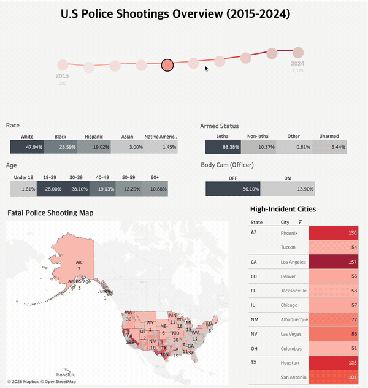

# U.S. Police Shootings Dashboard

미국 경찰 총격 사망 사건 데이터를 분석하고, 주요 현황을 한눈에 확인할 수 있도록 제작한 Tableau 대시보드입니다.
Source from The Washington Post
## Links

- **Tableau Dashboard:** [대시보드 바로가기](https://public.tableau.com/app/profile/hye.lin.yu/viz/U_SPoliceShootingsOverview2015-2024/USPoliceShooting)

## Dashboard Demo

GIF를 클릭하면 인터랙티브 Tableau 대시보드로 이동합니다.

## Project Overview

이 프로젝트는 미국 내 경찰 총격 사망 사건의 연도별 추이와 인구통계학적 특성, 사건 당시 무장 상태, 경찰관 보디캠 사용 여부, 지역별 발생 현황을 분석합니다.

대시보드에서는 다음 항목을 확인할 수 있습니다.

- **연도별 추이:** 2015년부터 2024년까지 경찰 총격 사망 사건 변화
- **인종별 분포:** White, Black, Hispanic, Asian, Native American
- **연령별 분포:** Under 18부터 60+까지 연령대별 비율
- **무장 상태:** Lethal, Non-lethal, Other, Unarmed
- **보디캠 사용 여부:** 사건 당시 경찰관 보디캠 ON/OFF 비율
- **지역별 현황:** 미국 지도 기반 사건 분포
- **고발생 도시:** 경찰 총격 사건이 많이 발생한 도시 비교

## Key Findings

- 2024년 집계 건수는 **1,175건**으로, 2015년 **995건**보다 증가했습니다.
- 인종별 비중은 **White 50.69%**, **Black 27.04%**, **Hispanic 18.69%** 순으로 나타났습니다.
- 연령대별로는 **30–39세가 30.44%**로 가장 높은 비중을 차지했습니다.
- 사건 당시 대상자의 **79.70%가 치명적 무기(Lethal)**를 소지한 것으로 분류되었습니다.
- 경찰관 보디캠이 꺼져 있던 사건은 **82.75%**, 켜져 있던 사건은 **17.25%**였습니다.
- 화면에 표시된 고발생 도시 중 **Los Angeles 157건**, **Phoenix 130건**으로 집계되었습니다.
